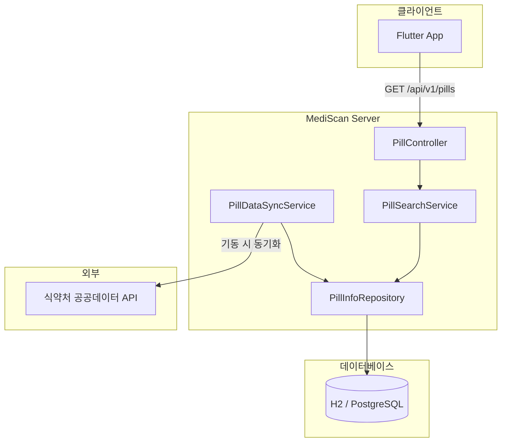
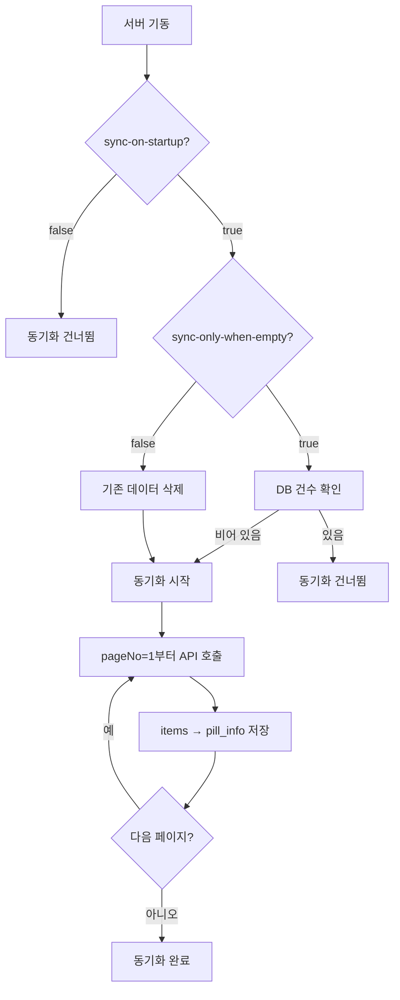
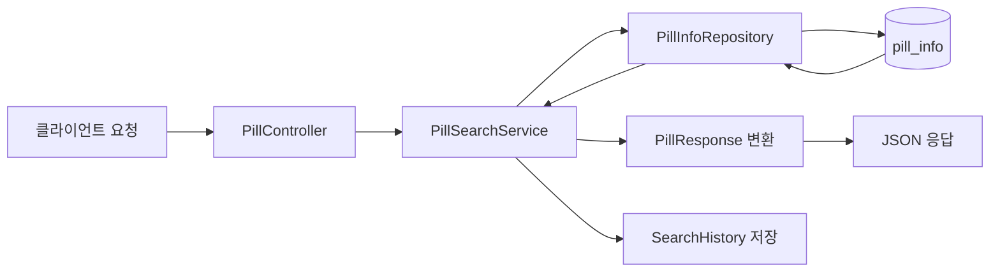

# MediScan Server

Spring Boot API 서버로, [식약처 공공데이터포털](https://www.data.go.kr/data/15057639/openapi.do) 낱알식별 API를 활용해 **알약 식별 정보**를 제공합니다. Flutter/모바일 앱에서 OCR로 읽은 식별문자·모양·색상을 기준으로 의약품을 검색할 수 있습니다.

---

## 목차

- [아키텍처](#아키텍처)
- [기술 스택](#기술-스택)
- [시스템 흐름](#시스템-흐름)
- [시작하기](#시작하기)
- [설정](#설정)
- [API 사용법](#api-사용법)
- [데이터베이스](#데이터베이스)
- [프론트엔드 연동](#프론트엔드-연동)

---

## 아키텍처

```
┌─────────────────┐     ┌──────────────────────┐     ┌─────────────────────────┐
│  Flutter App    │────▶│   MediScan Server    │────▶│  식약처 공공데이터 API   │
│  (클라이언트)    │     │   (Spring Boot)      │     │  (data.go.kr)           │
└─────────────────┘     └──────────────────────┘     └─────────────────────────┘
        │                            │
        │  GET /api/v1/pills         │  기동 시 전체 페이지 페이징 호출
        │  ?print=&shape=&color=     │  → pill_info 테이블에 저장
        │                            │
        │                            ▼
        │                   ┌─────────────────────┐
        │                   │  H2 / PostgreSQL    │
        │                   │  pill_info          │
        │                   │  search_history     │
        │                   └─────────────────────┘
        │
        ◀── JSON 응답 (33개 필드)
```

### 컴포넌트 다이어그램



---

## 기술 스택

| 구분 | 기술 |
|------|------|
| Runtime | Java 21 |
| Framework | Spring Boot 3.4.2 |
| DB | H2 (개발), PostgreSQL (운영 권장) |
| HTTP Client | Spring Cloud OpenFeign |
| Build | Gradle (Groovy DSL) |

---

## 시스템 흐름

### 1. 기동 시 데이터 동기화 흐름



### 2. 검색 요청 흐름



---

## 시작하기

### 사전 요구사항

- **Java 21** 이상
- **공공데이터포털 인증키** ([발급](https://www.data.go.kr/data/15057639/openapi.do))

### 1. 저장소 클론

```bash
git clone https://github.com/YOUR_USERNAME/mediscan-server.git
cd mediscan-server
```

### 2. 인증키 설정

인증키는 반드시 환경변수로 설정합니다. **절대 `application.yml`에 직접 입력하지 마세요.**

**Windows (PowerShell)**

```powershell
$env:API_PUBLIC_DATA_SERVICE_KEY="발급받은_인증키"
```

**Linux / macOS**

```bash
export API_PUBLIC_DATA_SERVICE_KEY="발급받은_인증키"
```

> `.env.example`을 복사해 `.env`로 만들고 값을 채운 뒤, 실행 시 로드하는 방식도 가능합니다.

### 3. 실행

```bash
# Windows (PowerShell)
.\gradlew.bat bootRun

# Windows (UTF-8 콘솔용 - 한글 로그 권장)
.\run.ps1

# Linux / macOS
./gradlew bootRun
```

- 서버: `http://localhost:8080`
- H2 콘솔 (dev): `http://localhost:8080/h2-console`

### 4. 동기화 옵션 (필수)

최초 실행 시 **데이터 동기화**를 해야 검색이 동작합니다.

```powershell
# 기동 시 동기화 활성화 (필수)
$env:API_SYNC_ON_STARTUP="true"
# DB 비었을 때만 동기화 (권장: 두 번째 실행부터 생략)
$env:API_SYNC_ONLY_WHEN_EMPTY="true"

.\gradlew.bat bootRun
```

동기화가 끝날 때까지 대기한 후, 아래처럼 검색을 시도합니다.

---

## 설정

| 환경변수 | 기본값 | 설명 |
|----------|--------|------|
| `API_PUBLIC_DATA_SERVICE_KEY` | - | 공공데이터 인증키 **(필수)** |
| `SPRING_PROFILES_ACTIVE` | prod | `dev` (H2) / `prod` (PostgreSQL) |
| `API_SYNC_ON_STARTUP` | false | 기동 시 동기화 여부 |
| `API_SYNC_ONLY_WHEN_EMPTY` | false | DB 비었을 때만 동기화 여부 |

상세 설정은 `application.yml`, `application-dev.yml`, `application-prod.yml`을 참고하세요.

---

## API 사용법

### 알약 검색

| 항목 | 값 |
|------|-----|
| Method | GET |
| Path | `/api/v1/pills` |
| Content-Type | application/json (응답) |

**쿼리 파라미터**

| 파라미터 | 필수 | 설명 |
|----------|------|------|
| print | ✅ | 식별문자 (OCR 결과, 예: IDG, TY) |
| shape | | 모양 (원형, 타원형, 장방형 등) |
| color | | 색상 (하양, 노랑, 연두 등) |

**예시**

```bash
curl "http://localhost:8080/api/v1/pills?print=IDG&shape=원형&color=연두"
```

**응답 예시**

```json
[
  {
    "itemSeq": "200808876",
    "itemName": "가스디알정50밀리그램(디메크로틴산마그네슘)",
    "entpName": "일동제약(주)",
    "chart": "녹색의 원형 필름코팅정",
    "itemImage": "https://nedrug.mfds.go.kr/...",
    "drugShape": "원형",
    "colorClass": "연두",
    "printFront": "IDG",
    ...
  }
]
```

응답은 항상 배열입니다. 0건이면 `[]`, 1건 이상이면 해당 항목들(전체 33개 필드)을 반환합니다.

---

## 데이터베이스

| 프로파일 | DB | 용도 |
|----------|-----|------|
| dev | H2 (파일) | 로컬 개발, 별도 설치 없음 |
| prod | PostgreSQL | 운영 환경 권장 |

**PostgreSQL 예시 (Docker)**

```bash
docker run -d --name mediscan-db \
  -e POSTGRES_DB=mediscan \
  -e POSTGRES_USER=mediscan \
  -e POSTGRES_PASSWORD=your_password \
  -p 5432:5432 \
  postgres:16
```

```powershell
$env:SPRING_PROFILES_ACTIVE="prod"
$env:SPRING_DATASOURCE_URL="jdbc:postgresql://localhost:5432/mediscan"
$env:SPRING_DATASOURCE_USERNAME="mediscan"
$env:SPRING_DATASOURCE_PASSWORD="your_password"
.\gradlew.bat bootRun
```

---

## 프론트엔드 연동

Flutter 앱과의 연동 방법은 [docs/FLUTTER_API_INTEGRATION.md](docs/FLUTTER_API_INTEGRATION.md)를 참고하세요.

- Base URL 환경별 설정 (에뮬레이터, 실제 기기)
- Pill 모델 (33개 필드 매핑)
- API 서비스 예시 코드
- CORS 설정

---

## 로그

- **콘솔**: UTF-8 출력
- **파일**: `log/mediscan.log` (일별 롤링, 30일 보관)

---

## 프로젝트 구조

```
src/main/java/com/mediscan/
├── MediScanServerApplication.java   # 엔트리포인트
├── client/                          # Feign 클라이언트 (공공데이터 API)
├── config/                          # CORS, RequestLoggingFilter
├── controller/                      # PillController
├── dto/                             # 요청/응답 DTO
├── entity/                          # JPA 엔티티 (PillInfo, SearchHistory)
├── exception/                       # 글로벌 예외 처리
├── repository/                      # JPA Repository
└── service/                         # PillSearchService, PillDataSyncService
```

---

## 라이선스

KYO License
