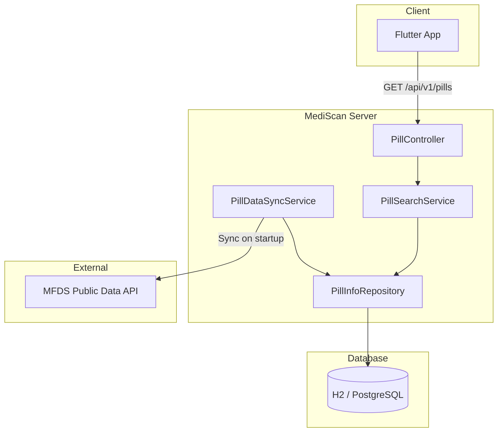
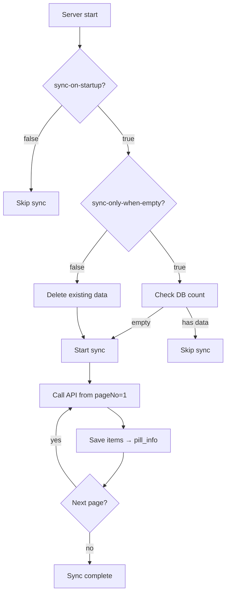
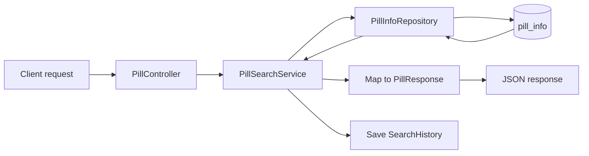

# MediScan Server

Spring Boot API server that provides **pill identification data** using the [Korea MFDS Public Data Portal](https://www.data.go.kr/data/15057639/openapi.do) pill identification API. Flutter/mobile apps can search for medicines by identifier text, shape, and color (e.g. from OCR).

---

## Table of Contents

- [Architecture](#architecture)
- [Tech Stack](#tech-stack)
- [System Flow](#system-flow)
- [Getting Started](#getting-started)
- [Configuration](#configuration)
- [API Usage](#api-usage)
- [Database](#database)
- [Frontend Integration](#frontend-integration)

---

## Architecture

```
┌─────────────────┐     ┌──────────────────────┐     ┌─────────────────────────┐
│  Flutter App    │────▶│   MediScan Server    │────▶│  MFDS Public Data API   │
│  (Client)       │     │   (Spring Boot)      │     │  (data.go.kr)            │
└─────────────────┘     └──────────────────────┘     └─────────────────────────┘
        │                            │
        │  GET /api/v1/pills         │  On startup: fetch all pages
        │  ?print=&shape=&color=     │  → store in pill_info table
        │                            │
        │                            ▼
        │                   ┌─────────────────────┐
        │                   │  H2 / PostgreSQL    │
        │                   │  pill_info         │
        │                   │  search_history    │
        │                   └─────────────────────┘
        │
        ◀── JSON response (33 fields)
```

### Component Diagram



---

## Tech Stack

| Category | Technology |
|----------|------------|
| Runtime | Java 21 |
| Framework | Spring Boot 3.4.2 |
| DB | H2 (dev), PostgreSQL (prod recommended) |
| HTTP Client | Spring Cloud OpenFeign |
| Build | Gradle (Groovy DSL) |

---

## System Flow

### 1. Data sync on startup



### 2. Search request flow



---

## Getting Started

### Prerequisites

- **Java 21** or later
- **Public Data Portal API key** ([Apply](https://www.data.go.kr/data/15057639/openapi.do))

### 1. Clone the repository

```bash
git clone https://github.com/YOUR_USERNAME/mediscan-server.git
cd mediscan-server
```

### 2. Set API key

Set the API key via environment variables. **Do not put it in `application.yml`.**

**Windows (PowerShell)**

```powershell
$env:API_PUBLIC_DATA_SERVICE_KEY="your_api_key"
```

**Linux / macOS**

```bash
export API_PUBLIC_DATA_SERVICE_KEY="your_api_key"
```

> You can copy `.env.example` to `.env`, fill in values, and run with `.\run.ps1` so the script loads `.env` into the environment.

### 3. Run

```bash
# Windows (PowerShell)
.\gradlew.bat bootRun

# Windows (UTF-8 console, loads .env)
.\run.ps1

# Linux / macOS
./gradlew bootRun
```

- Server: `http://localhost:8080`
- H2 console (dev): `http://localhost:8080/h2-console`

### 4. Sync option (required for first run)

Search works only after **data sync** has run at least once.

```powershell
# Enable sync on startup
$env:API_SYNC_ON_STARTUP="true"
# Sync only when DB is empty (recommended for subsequent runs)
$env:API_SYNC_ONLY_WHEN_EMPTY="true"

.\gradlew.bat bootRun
```

Wait for sync to finish, then try a search.

---

## Configuration

| Environment variable | Default | Description |
|---------------------|---------|-------------|
| `API_PUBLIC_DATA_SERVICE_KEY` | - | Public Data API key **(required)** |
| `SPRING_PROFILES_ACTIVE` | dev | `dev` (H2) / `prod` (PostgreSQL) |
| `API_SYNC_ON_STARTUP` | false | Run sync on startup |
| `API_SYNC_ONLY_WHEN_EMPTY` | false | Sync only when DB is empty |

See `application.yml`, `application-dev.yml`, and `application-prod.yml` for full configuration.

---

## API Usage

### Pill search

| Item | Value |
|------|-------|
| Method | GET |
| Path | `/api/v1/pills` |
| Content-Type | application/json (response) |

**Query parameters**

| Parameter | Required | Description |
|-----------|----------|-------------|
| print | ✅ | Identifier text (e.g. from OCR: IDG, TY) |
| shape | | Shape (e.g. round, oval, oblong) |
| color | | Color (e.g. white, yellow, green) |

**Example**

```bash
curl "http://localhost:8080/api/v1/pills?print=IDG&shape=원형&color=연두"
```

**Sample response**

```json
[
  {
    "itemSeq": "200808876",
    "itemName": "가스디알정50밀리그램(디메크로틴산마그네슘)",
    "entpName": "일동제약(주)",
    "chart": "녹색의 원형 필름코팅정",
    "itemImage": "https://nedrug.mfds.go.kr/...",
    "drugShape": "원형",
    "colorClass": "연두",
    "printFront": "IDG",
    ...
  }
]
```

The response is always an array: empty `[]` for no results, or one or more items (33 fields each).

---

## Database

| Profile | DB | Use case |
|---------|-----|----------|
| dev | H2 (file) | Local development, no extra setup |
| prod | PostgreSQL | Production |

**PostgreSQL example (Docker)**

```bash
docker run -d --name mediscan-db \
  -e POSTGRES_DB=mediscan \
  -e POSTGRES_USER=mediscan \
  -e POSTGRES_PASSWORD=your_password \
  -p 5432:5432 \
  postgres:16
```

```powershell
$env:SPRING_PROFILES_ACTIVE="prod"
$env:SPRING_DATASOURCE_URL="jdbc:postgresql://localhost:5432/mediscan"
$env:SPRING_DATASOURCE_USERNAME="mediscan"
$env:SPRING_DATASOURCE_PASSWORD="your_password"
.\gradlew.bat bootRun
```

---

## Frontend Integration

See [docs/FLUTTER_API_INTEGRATION.md](docs/FLUTTER_API_INTEGRATION.md) for Flutter integration.

- Base URL per environment (emulator, device)
- Pill model (33 fields)
- API service example
- CORS setup

---

## Logging

- **Console**: UTF-8
- **File**: `log/mediscan.log` (daily rollover, 30-day retention)

---

## Project structure

```
src/main/java/com/mediscan/
├── MediScanServerApplication.java   # Entry point
├── client/                          # Feign client (MFDS API)
├── config/                          # CORS, RequestLoggingFilter
├── controller/                      # PillController
├── dto/                             # Request/response DTOs
├── entity/                          # JPA entities (PillInfo, SearchHistory)
├── exception/                       # Global exception handler
├── repository/                      # JPA repositories
└── service/                         # PillSearchService, PillDataSyncService
```

---

## License

None
